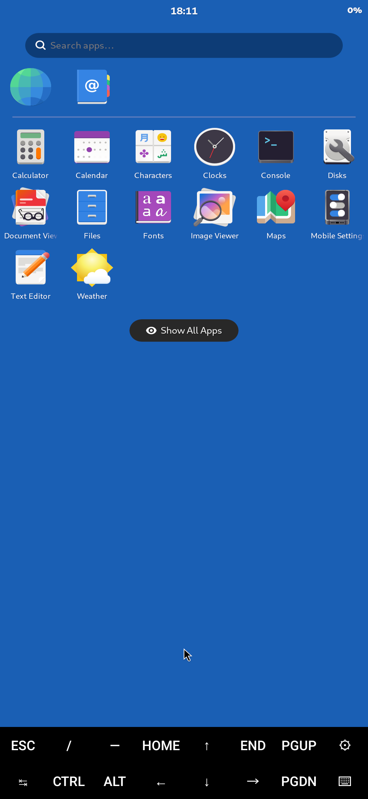
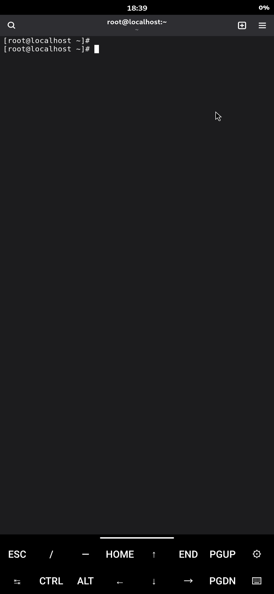

# phosh-termux-gpu

**Hardware-accelerated [Phosh](https://gitlab.gnome.org/World/Phosh/phosh) (the mobile GNOME shell) on a stock, unrooted Qualcomm Android phone**, running in [Termux](https://termux.dev) + a Fedora `proot-distro` container, GPU-composited on the **Adreno** GPU via a patched wlroots and a KGSL **Turnip** (Vulkan) driver.

Developed and verified on a **Samsung Galaxy S25 (Snapdragon 8 Elite / Adreno 830, Android 16, unrooted)**. It should adapt to other recent Snapdragon devices (a7xx/a8xx Adreno) with little or no change.

> **The short version of why this is interesting:** wlroots' X11 backend normally needs DRI3/DMA-BUF for any GPU renderer, which the software X server (Termux:X11) doesn't provide, and the Adreno GPU has no DRM render node (it's KGSL-only). This project bypasses **both** walls: phoc composites on the GPU with Vulkan/Turnip and presents the finished frame to Termux:X11 over the existing **software (XShm) path** — no DRI3, no DMA-BUF.




---

## What you get

- The **Phosh** lock screen, app grid, top panel and home bar, **GPU-composited** on the Adreno GPU.
- GTK apps (Console, Text Editor, Settings, …) launch and run.
- A **software fallback** (`launch-sw.sh`) using the pixman CPU compositor — rock-solid, for when you don't care about acceleration.

## Status / honesty

- ✅ The GPU compositor works and is stable enough for daily poking around.
- ⚠️ There is a **rare** (~1 in 4 cold starts) intermittent crash right after unlock. The `*-segv` launcher captures a backtrace if it bites you. The software fallback never has this.
- ⚠️ Apps render their **own** contents in software (cairo) — there is no in-app GPU acceleration, because the compositor can't share DMA-BUFs here. The *compositing* (blending, the whole screen) is on the GPU.
- ⚠️ Turnip on the Adreno 830 is brand-new in Mesa; we build Mesa **main** because that's where the a8xx support lives.

---

## Requirements

| | |
|---|---|
| Device | Snapdragon with a recent Adreno (tested: 8 Elite / Adreno 830). `/dev/kgsl-3d0` must be world-accessible (`crw-rw-rw-`). |
| Root | **Not required.** |
| Apps | [Termux](https://github.com/termux/termux-app) (F-Droid/GitHub build) + [Termux:X11](https://github.com/termux/termux-x11) |
| Disk | ~6–8 GB (Fedora + Mesa + wlroots source/builds) |
| Time | ~1–2 h (mostly the Mesa + wlroots compiles) |

---

## Install

Run everything **inside the Termux app** (not over adb):

```bash
pkg install -y git
git clone https://github.com/Azkali/phosh-termux-gpu.git
cd phosh-termux-gpu
bash install.sh
```

`install.sh` is idempotent and split into phases — if one fails you can re-run it, or run a phase by hand (see [INSTALL.md](INSTALL.md)). It will:

1. Install Termux packages (Termux:X11 nightly, virgl, pulseaudio, proot-distro…).
2. Install **Fedora** via proot-distro (if not already present).
3. Provision Fedora with phosh / phoc / mesa / fonts.
4. Build a **KGSL Turnip** from Mesa `main` → `/opt/mesa-kgsl-git` (in the container).
5. Build the **patched wlroots 0.19** → `/root/wlroots/build` (in the container).
6. Install the launch scripts, `phoc.ini`, and the crash handler into the container.

### Then configure Termux:X11 (one-time, manual)

These live in the Termux:X11 app's own preferences and **cannot be scripted**. Open Termux:X11 → pull down the notification / open settings and set:

- **Display resolution mode:** `exact`, and **Custom resolution** = your panel, e.g. `1080x2336`
- **Touchscreen / touch mode:** `Native touchscreen`
- **Stretch to fit / displayStretch:** ON
- **Hide cutout:** ON · **Fullscreen:** ON
- **Adjust resolution on soft-keyboard:** OFF (so the Android keyboard *overlays* phosh instead of squishing it)

---

## Run

```bash
bash start.sh          # accelerated (GPU) phosh
bash start.sh --sw     # software (pixman) phosh — reliable fallback
bash start.sh --debug  # accelerated + crash-backtrace handler (for the rare race)
```

`start.sh` brings up the Termux:X11 server + virgl + audio, foregrounds the Termux:X11 activity, and launches the phosh session. Switch to the Termux:X11 app to use the phone.

To stop: `bash stop.sh` (or just kill phoc from Termux).

---

## How it works

```
[ Fedora proot ]  phosh (GTK, cairo/shm)
                       │ wayland
                  phoc  ──>  PATCHED wlroots 0.19
                              • Vulkan renderer on Turnip/KGSL  (composite on the Adreno GPU)
                              • renders into a device-local VkImage,
                                copies it into an shm buffer
                              • presents that shm buffer via the X11 backend's
                                XShm path  ── NO DRI3, NO DMA-BUF
                       │ X11 (MIT-SHM)
[ Termux / bionic ]  Termux:X11  (software X server)  ──>  Android SurfaceFlinger
[ Android ]          /dev/kgsl-3d0   (Adreno, KGSL — world-readable, no root)
```

The two key pieces of original work:

1. **Patched wlroots** (`fedora/apply_wlr_patches.py`, ~16 small patches to wlroots 0.19): let the Vulkan renderer initialise **without a DRM fd**, render into shm output buffers (internal VkImage → `vkCmdCopyImageToBuffer` → host-visible staging → memcpy into the shm buffer in the render command buffer), advertise shm render formats, skip the foreign-queue transfer for shm buffers, plus two real wlroots bug fixes that phosh trips (a texture double-destroy and an over-strict layer-shell check). phoc links wlroots **dynamically**, so we only swap the rebuilt `libwlroots-0.19.so` in via `LD_LIBRARY_PATH` — no phoc rebuild.

2. **KGSL Turnip from Mesa main** (`fedora/3-build-turnip.sh`): Mesa main already has native Adreno 830 + UBWC 5.0 support; we build it with `-Dfreedreno-kmds=kgsl` so it talks to `/dev/kgsl-3d0` (the only GPU interface exposed to app domains), plus a one-line patch so `vulkaninfo` doesn't trip over `KHR_display`.

See [docs/ARCHITECTURE.md](docs/ARCHITECTURE.md) for the full story (and the dead-ends).

---

## Troubleshooting

- **Black screen after lots of restarts** — Termux:X11's server gets into a stale state. Re-run `bash start.sh` (it restarts the X server). A known-good *software* phosh going black is the tell-tale.
- **An app (Console, etc.) crashes instantly** — make sure `GSK_RENDERER=cairo` is in the launcher (it is by default). GTK4 otherwise tries GPU rendering the compositor can't provide.
- **phoc dies right after unlock** — that's the rare race; use `bash start.sh --sw` for now, or `--debug` to capture a backtrace and open an issue.
- **`vulkaninfo` shows llvmpipe, not Adreno** — check `VK_ICD_FILENAMES` points at `/opt/mesa-kgsl-git/...` and `/dev/kgsl-3d0` is `crw-rw-rw-`.

---

## Credits & licence

This is glue + patches around the real work of others: **wlroots**, **Mesa/Turnip (freedreno)**, **Phosh/phoc** (Phosh / GNOME), **Termux** and **Termux:X11**. The patches in `fedora/apply_wlr_patches.py` are derivatives of wlroots (MIT) and the Turnip change of Mesa (MIT). This repository's own scripts are MIT-licensed — see [LICENSE](LICENSE). It is an unofficial community hack and is not affiliated with any of the upstreams.
